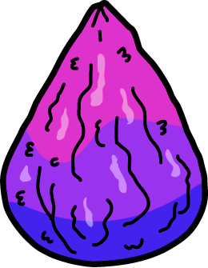
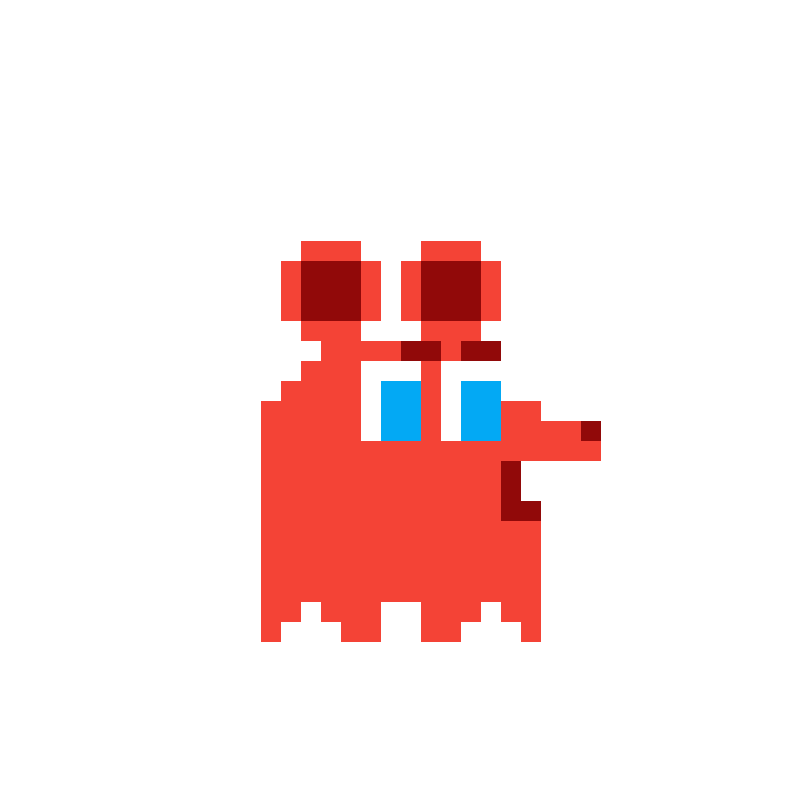
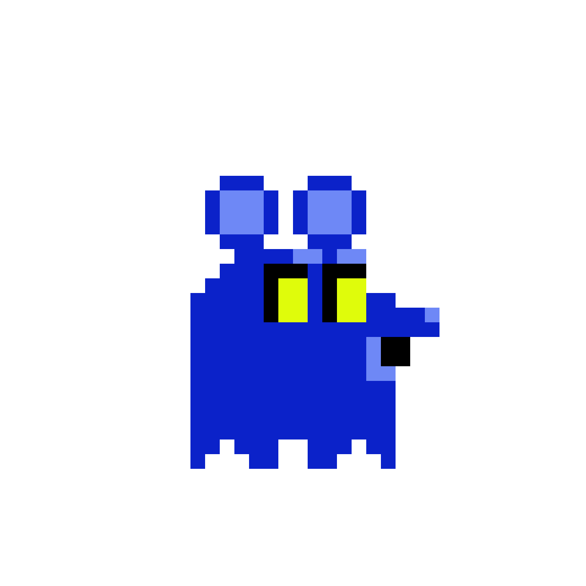
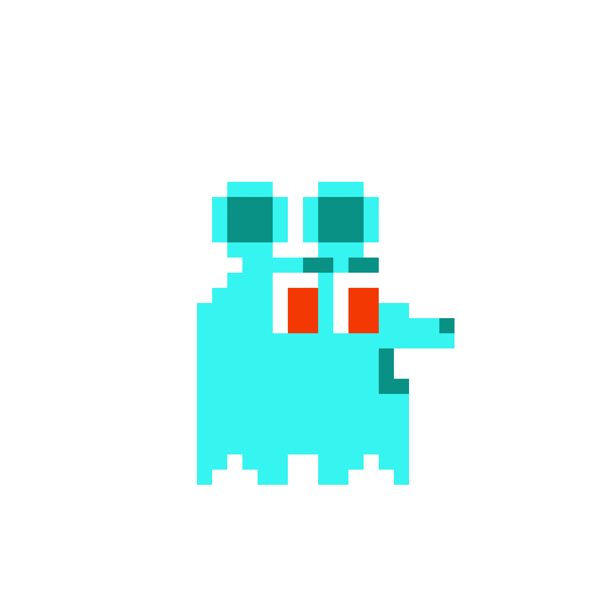
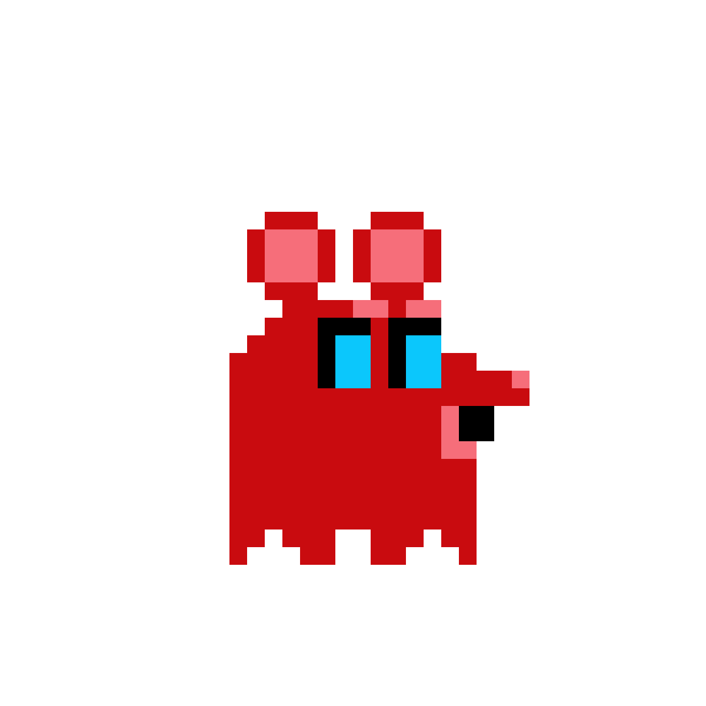
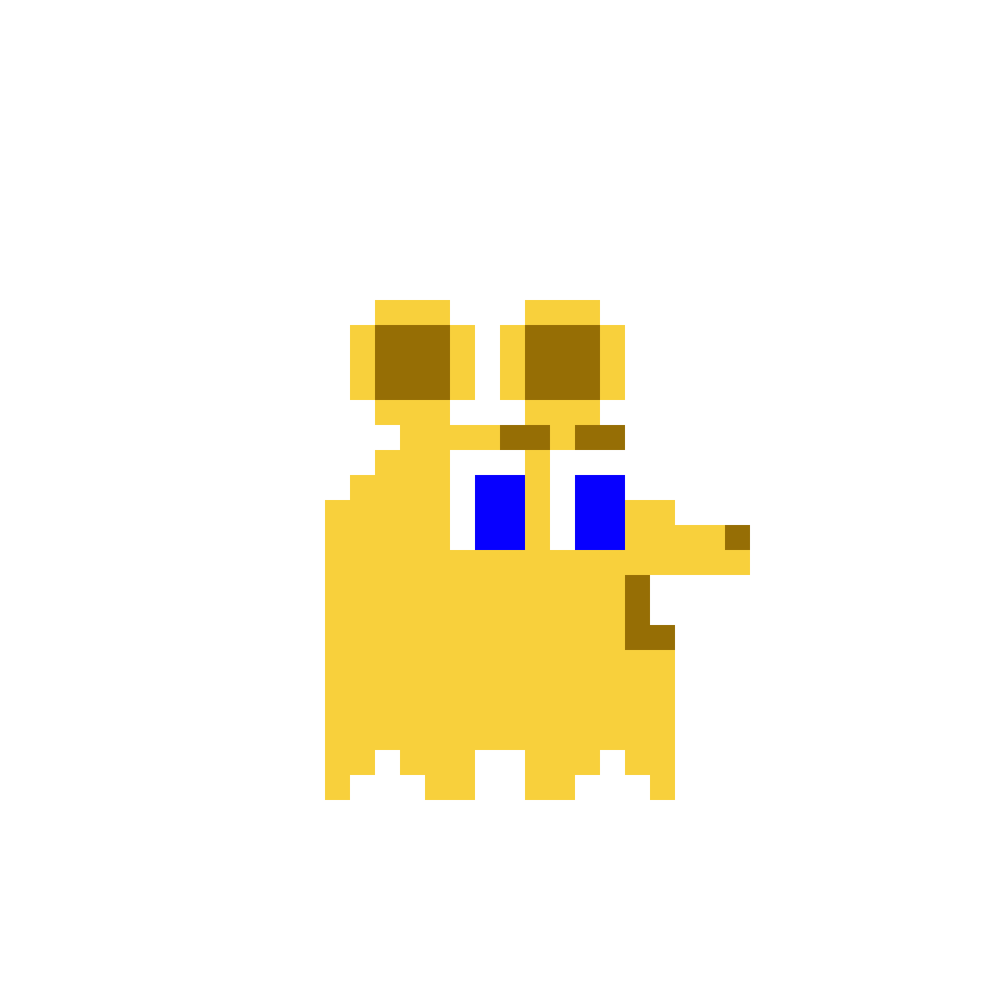
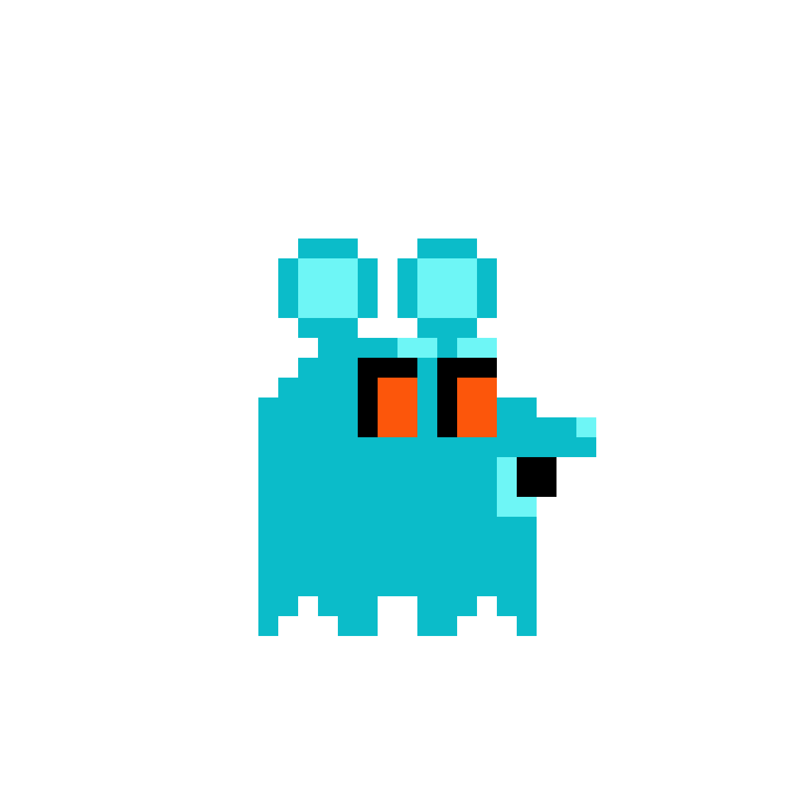

<h1 align="center">Welcome to Pickle Man 🥒👨</h1>

  

### ✨ [Demo](https://joinsambalboa.github.io/Project-One/)

### 📙 What is Pickle Man?
> This is a Rick and Morty inspired Pac-Man clone using purely HTML, CSS, and Vanilla Javascript. User is able to control the main character, Pickle Man, who is tasked with collecting all of the mega seeds to escape the sewers he finds himself in, whilst avoiding the ghost-rats. The user is also able to use Szechuan sauces, placed in each corner of the game, to enable the ghost-rats be eliminated and get additional points.

### 💾 Technologies Used
<li>HTML</li>
<li>CSS</li>
<li>JS (Vanilla)</li>

### 🚀 Approach
<h4>Flex Grid</h4>
<li>Created a 13 x 13 grid using flexbox.</li>
<li>Used logical statements to add barriers, including horizontal and vertical which gave the grids specific classes.</li>

<h4>Seeds and Sauce</h4>
<li>Used local statements to add seeds and sauces to the specific grid boxes</li>
<li>When interacted with, the seed/sauce will no longer be available</li>
<li>These items gave the user points</li>
<li>When the seeds are all collected, the game ends</li>
<li>When sauce is eaten, the ghost-rats are vulnerable and the user can eliminate them for extra points and to send them back to where they started</li>

| Item | Points | Effect |
|--|--|--|
|  | 20 | Once all collected, game is over |
|  | 50 | Allows ghost-rats to be eliminated and returns them to their starting position |

<h4>User</h4>
<li>Using the arrow keys, user is able to control the player to move around the sewer to collect megaseeds and sauces</li>
<li>The user is able to interact with everything in the sewers: Megaseeds - gives 20 points, and once all collected the game ends. Szechaun Sauce - gives 50 points, makes the ghost-rats vulnerable. Ghosts-rats - Takes one life away, and returns the user to starting position. Scared Ghost-Rats - eliminate them and send them back to their beginning position.

<h4>Ghost Rats</h4>
<li>Ghost-rats were all created with the same logic to move randomly around the sewer</li>
<li>They were also given additional logic to move towards the user dependant on the users position in the sewers</li>
<li>They are able to take a life away from the user and return him to his starting position of the game</li>

| Ghost-rat | Scared Ghost-rat |
|--|--|
|  |  |
|  |  |
|  |  |
|

### Difficulties
<li>Refactoring the code to make it more readable, and DRY. Due to issues at the end, I wasn't able to do this and bugs were more likely to appear</li>
<li>The ghost rat movement to be truly random and also move towards the user basen on his position</li>

### Wins
<li>Getting the ghost-rats to change for the set interval and change back in the right place</li>
<li>I learnt alot from this project and will definitely provide learnings for future projects</li>
<li>Creating a game from scratch using skills learnt in the last 3 weeks</li>

## Author

👤 **Jason Abimbola**

* Github: [@JoinSamBalboa](https://github.com/JoinSamBalboa)
* LinkedIn: [@JoinSamBalboa](https://linkedin.com/in/joinsambalboa)

